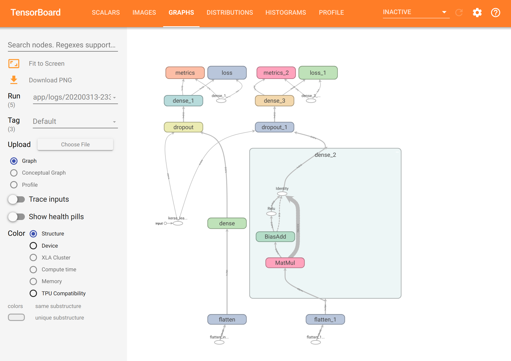
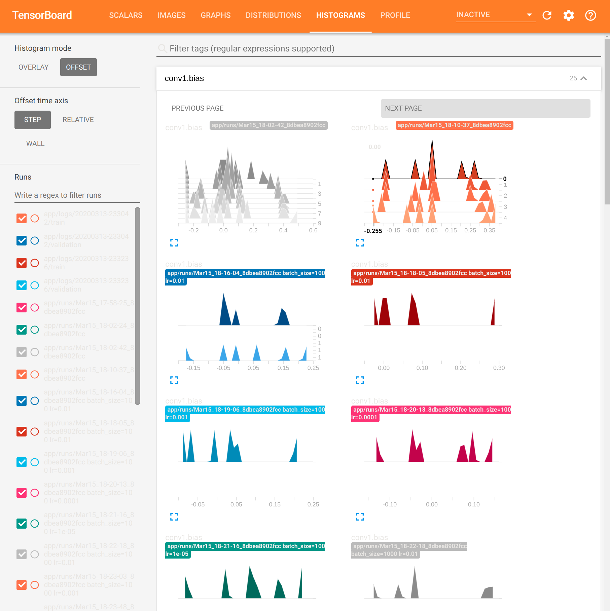

### NVIDIA GPU/Tensor Core Accelerator for PyTorch, Tensorflow 2, Tensorboard + OpenCV
A complete machine vision container that includes Jupyter notebooks with built-in code hinting, Anaconda, CUDA-X, TensorRT inference accelerator for Tensor cores, CuPy (GPU drop in replacement for Numpy), PyTorch, TF2, Tensorboard, and OpenCV for accelerated workloads on NVIDIA Tensor cores and GPUs.

-----------------------------------------------------------

### Features ###
- Anaconda: Accelerated Python, version 3.7.3
- CuPy: GPU accelerated drop in for Numpy
- OpenCV, latest version which compiles for GPU in the container
- PyTorch with Torchvision for GPU, latest version
- Tensorflow 2 with Keras
- Tensorboard for both Torch and TF2
- NVIDIA TensorRT inference accelerator for Tensor core access and CUDA 10 for GPUs
- TFX/TensorFlow serving for monitoring, locking in gpu/cpu arch for reproducibility, and model serving via rest api

### Built in code hinting in Jupyter Notebook ###

Press tab to see what methods you have access to, sometimes you may want to show the Jupyter original complete temporally, then click shift + space.


### Security Concern for Code Hinting ###

The enabled code hinting for the Juypter Notebook causes a known security breach, if security is a concern go into the Dockerfile and comment out line 119:


1. Line 119: ` RUN pip install jupyter-tabnine `

2. Code hinting won't be installed, but this shores up/fixes the security exploit.

3. You can use the new [VSCode](https://code.visualstudio.com/download) and install the [Python module](https://marketplace.visualstudio.com/items?itemName=ms-python.python) which supports code hinting, as well as chart generation. It works no different than a jupyter notebook does, as an alternative option to presereve same dev features. Just open an existing project in VSCode at the ``` /app ``` folder level, and it will automatically do "hot-updates" and reload the container for you, as you save your work and run it from VSCode. (So don't worry, all the charts and things you're used to seeing in juypter will be generated in VSCode for you via the container).

--------------------------------------------------------------------------------
### Before you begin (This might be optional) ###

Link to nvidia-docker2 install: [Tutorial](https://medium.com/@sh.tsang/docker-tutorial-5-nvidia-docker-2-0-installation-in-ubuntu-18-04-cb80f17cac65)

You must install nvidia-docker2 and all it's deps first, assuming that is done, run:


 ` sudo apt-get install nvidia-docker2 `
 
 ` sudo pkill -SIGHUP dockerd `
 
 ` sudo systemctl daemon-reload `
 
 ` sudo systemctl restart docker `
 

How to run this container:


## If using Dockerfile (will not deploy TFX/TensorFlow Serving):

### Step 1 ###

` docker build -t <container name> . `  < note the . after <container name>


### Step 2 ###

Run the image, mount the volumes for Jupyter and app folder for your fav IDE, and finally the expose ports `8888` for Jupyter Notebook:


` docker run --rm -it --runtime=nvidia --user $(id -u):$(id -g) --group-add container_user --group-add sudo -v "${PWD}:/app" -p 8888:8888 -p 6006:6006 <container name> `


## If using docker-compose:

Install the the nvidia-conatiner-runtime package, install and set-up config is here: https://github.com/NVIDIA/nvidia-container-runtime.

` sudo apt-get install nvidia-container-runtime `

` sudo vim /etc/docker/daemon.json `

Then , in this `daemon.json` file, add this content:

```
{
  "default-runtime": "nvidia"
  "runtimes": {
    "nvidia": {
      "path": "/usr/bin/nvidia-container-runtime",
       "runtimeArgs": []
     }
  }
}
```

` sudo systemctl daemon-reload `

` sudo systemctl restart docker `


### Step 1

` docker-compose build `

### Step 2

` docker-compose up `

<em><strong>Note:</strong> TFX will query the folder path until it gets a trained model to serve in the cmd line and issue warnings, this is harmless</em>


### Step 3: Check to make sure GPU drivers and CUDA is running ###

- <strong>Open another ssh tab</strong>, and exec into the container and check if your GPU is registering in the container and CUDA is working:

- Get the container id:

` docker ps `

- Exec into container:

` docker exec -u root -t -i <container id> /bin/bash `

- Check if NVIDIA GPU DRIVERS have container access:

` nvidia-smi `

- Check if CUDA is working:

` nvcc -V `


### Initialize Tensorboard

- Exec into the container as stated above, and run the following:

`tensorboard --logdir=//app --bind_all `

- You will recieve output that looks somnething like this:

`TensorBoard 2.1.0 at http://af5d7fc520cb:6006/`

Just replace `af5d7fc520cb` with localhost and launch in the browser, the you will see:







## Tensorflow Serving

Tensorflow serving provides a REST api at port 8501. 
* Tensorflow-serving requires models to have a version nr in the model path *path_to_model/xxx/saved_model.pb*
     * If you download a pretrained tensorflow model, change the directory name of saved_model directory to some random version number (e.g. 001))

--------------------------------------------------


### Known conflicts with nvidia-docker and Ubuntu ###

AppArmor on Ubuntu has sec issues, so remove docker from it on your local box, (it does not hurt security on your computer):

` sudo aa-remove-unknown `

--------------------------------------------------

